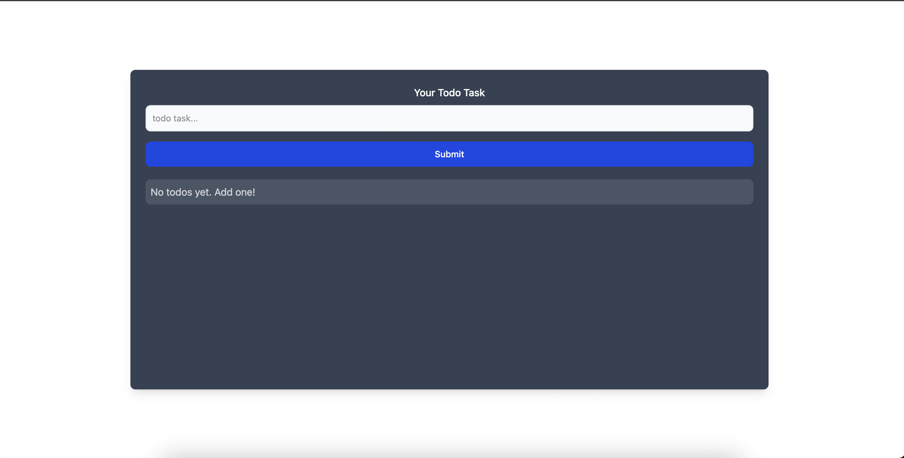
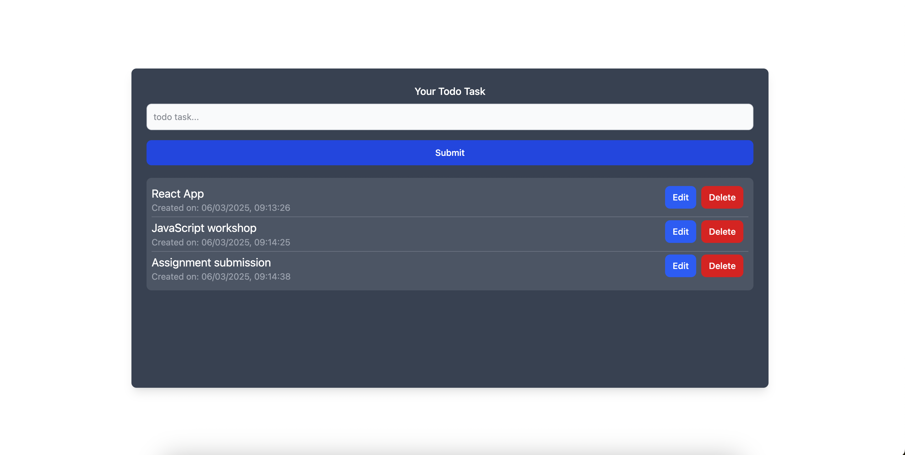

# 📝 Todo App – React & Redux Task Manager

### 🚀 A modern, feature-rich Todo App built with React, Redux Toolkit, Tailwind CSS & Local Storage

## 📌 Features

✅ **Add, Edit & Delete Todos** – Manage your tasks seamlessly  
✅ **Persistent Storage** – Saves tasks even after refreshing the page using `localStorage`  
✅ **Redux State Management** – Uses `Redux Toolkit` to store and manage todos globally  
✅ **Responsive UI** – Styled with `Tailwind CSS` for a modern, user-friendly experience  
✅ **Fast & Optimized** – Efficient state updates using React’s `useState` and `useEffect` hooks  

---

## 🛠️ Tech Stack

- **Frontend:** React.js, Redux Toolkit, Tailwind CSS  
- **State Management:** Redux for global state  
- **Storage:** localStorage for data persistence  
- **Styling:** Tailwind CSS for modern UI design  

---

## 📂 Installation & Setup

1️⃣ **Clone the repository**  
```bash
git clone https://github.com/yourusername/TodoApp.git
cd TodoApp
```
2️⃣ **Install dependencies**
```bash
npm install
```
3️⃣ **Run the application**
```bash
npm start
```
The app will be available at http://localhost:5713/.

## 🛠️ Local Storage Integration

The app uses localStorage to store todos persistently. Whenever a task is added, edited, or deleted, the updated state is automatically saved.
On page reload, useEffect retrieves the stored data and syncs it with Redux.

```js
useEffect(() => {
    const storedTodos = JSON.parse(localStorage.getItem('todos'));
    if (storedTodos) {
      dispatch(setTodos(storedTodos));
    }
}, [dispatch]);

useEffect(() => {
    localStorage.setItem('todos', JSON.stringify(todos));
}, [todos]);
```
## 📜 How It Works

1️⃣ **Adding a Todo** – The user enters text, and on submit, the task is stored in Redux & localStorage.  
2️⃣ **Editing a Todo** – The user clicks "Edit," modifies the text, and saves the changes.  
3️⃣ **Deleting a Todo** – Clicking "Delete" removes the task from Redux & localStorage.

## 📸 Page Views

### When no Todos are present:


### When Todos are present:


## 🤝 Contributing

Want to improve this project? Follow these steps:
1. Fork the repo
2. Create a feature branch (git checkout -b feature-branch)
3. Commit your changes (git commit -m "Added a new feature")
4. Push to the branch (git push origin feature-branch)
5. Create a Pull Request

## ⭐ Show Some Love
If you like this project, give it a star ⭐ on GitHub to support its development! 🚀


